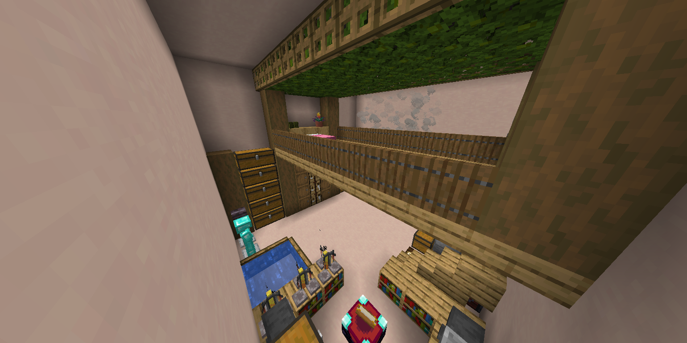

# Pocket Storage

A portable room that you can store anything inside, chests, furnaces, a bedroom, whatever you want. Stored inside a pocket dimension

## Usage

Make a Pocket Chest block and place it in the world, and simply right click and you'll enter your own pocket room.

When you are done, you can mine the chest with a pickaxe, and carry it with you.

By default, the config uses the structure `pocket_storage:13x11x13_plain`, which is an empty box of white terracotta. The default structure can be changed in the config to any other structure. All structures are wrapped around with a solid bedrock wall. 

## License

[MIT](./LICENSE)

## Credits

Idea inspired by the void chest in the Flight SMP and Compact Machines.

Used code for references:
- Create
- Lootr 
- Compact Machines
